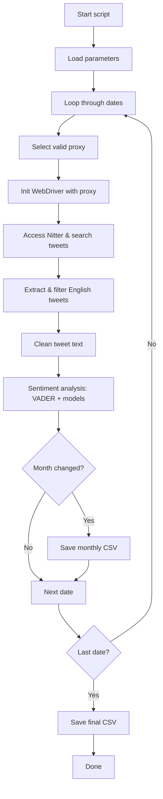

# 🐦 Tweet Scraper via Nitter + Sentiment Analysis

Ce projet permet de **scraper des tweets publics** depuis [Nitter](https://nitter.net), une alternative sans JavaScript à Twitter, et d'appliquer plusieurs **modèles d'analyse de sentiment**. Il est conçu pour contourner les limitations d'accès via un système de **rotation de proxies HTTPS**.

## 🎯 Objectif

- Récupérer quotidiennement des tweets liés à une entreprise donnée (ex : `Tesla`).
- Appliquer 5 modèles de sentiment (VADER + 4 Transformers financiers).
- Sauvegarder les résultats par mois et dans un fichier global, pour analyse de tendance ou backtest boursier.

---

## ⚙️ Dépendances
```bash
pip install selenium webdriver-manager pandas langdetect beautifulsoup4 requests vaderSentiment transformers
```
Python 3.8+ recommandé.

---

## 🚀 Lancer le scraping

```bash
python main.py
```

Cela lance le scraping pour la plage de dates définie dans `main.py`, par défaut entre le 15 et 19 avril 2025.

---

## 🔧 Paramètres configurables (`main.py`)
- `start_date` / `end_date` : plage de dates à scraper
- `company_name` : mot-clé recherché dans les tweets (par défaut : "Tesla")
- `minimum_number_tweets_per_day` : nombre minimum de tweets à collecter par jour

---

## 🧩 Fonctionnement (étapes principales)
1. **Initialisation des dates, modèles de sentiment et proxies**
2. **Pour chaque jour :**
   - Ouverture d'un navigateur avec proxy
   - Scraping sur Nitter
   - Nettoyage et filtrage des tweets en anglais
   - Analyse de sentiment avec VADER et 4 modèles Transformers
   - Enregistrement dans un buffer mensuel et global
3. **À chaque changement de mois :**
   - Écriture dans un fichier `Data_for_YYYY-MM.csv`
4. **À la fin du script :**
   - Fusion et sauvegarde finale dans `Data_<company>.csv`

---

## 📊 Schéma du processus de scraping



---

## 📁 Structure des fichiers

- `main.py` : script principal de scraping et orchestration
- `scrape.py` : logique de navigation sur Nitter, extraction des tweets
- `driver.py` : initialisation du navigateur Chrome avec proxy
- `utils.py` : génération de dates, gestion des proxies, nettoyage texte
- `sentiment.py` : analyse de sentiment avec VADER + Transformers

---

## 📄 Format de sortie

Les tweets sont sauvegardés dans :
- des fichiers mensuels : `Data_for_2025-04.csv`
- un fichier global : `Data_Tesla.csv`

Colonnes principales :
| id         | query_date | text               | verified | CLEANED_TWEET | SENTIMENT_VADER | SENTIMENT_ModelName |
|------------|------------|--------------------|----------|----------------|------------------|----------------------|
| tweet_id   | yyyy-mm-dd | contenu du tweet   | True/False | tweet nettoyé  | score [-1 à 1]   | score du modèle NLP  |

---

## 🛡️ Gestion des erreurs & contournement
- **Proxies HTTPS** : Récupérés depuis `sslproxies.org`, testés automatiquement.
- **Rotation automatique** : En cas d'échec, on change de proxy.
- **Retry** : Jusqu'à 3 tentatives par jour si le scraping échoue.
- **Filtrage linguistique** : Seuls les tweets détectés comme anglais sont conservés (`langdetect`).

---

## 📬 Contact
Pour toute amélioration ou suggestion, n'hésite pas à ouvrir une *issue* ou à me contacter directement.

