# Market-Sentiment Trading — *Tesla Case Study*

Track Twitter’s mood on $TSLA, quantify it with multi-model NLP, and turn it into live trading signals.  
Rather than running a one-off correlation between sentiment and price, this project builds an **adaptive pipeline** that:

* scrapes tweets daily via Nitter (no Twitter API needed),
* scores them with VADER plus three finance-tuned Transformer models,
* recalibrates weights and thresholds every trading day, and
* benchmarks the resulting strategy against buy-and-hold.

---

## Project Overview

### **Objective**
- **Build** a fully-adaptive pipeline that converts tweet sentiment into daily buy/sell signals.  
- **Optimize** model hyper-parameters on a rolling window to maximise risk-adjusted return.  
- **Evaluate** whether public mood provides actionable alpha beyond buy-and-hold.

### **Data Sources**
| Source | Details |
|--------|---------|
| **Twitter** | Scraped with headless Selenium via the *Nitter* front-end (no Twitter API needed). |
| **Market**  | Downloaded from https://fr.investing.com/equities/tesla-motors-historical-data |

---

## Workflow 🛠️

```mermaid
flowchart TD
  %% 1 · DATA PREP
  subgraph STEP1["1 • Data Prep"]
    direction TB
    A1["Scrape Nitter \\ proxy rotation"] --> A2["Clean text \\ deduplicate"]
    A2 --> A3["Sentiment score \\ VADER + 3 HF"]
    A3 --> A4["Daily agg. \\ verified vs non-verified"]
  end

  %% 2 · FEATURE ENG
  subgraph STEP2["2 • Feature Eng"]
    direction TB
    A4 --> B1["Filter \\ strong scores"]
    B1 --> B2["Normalise \\ Z-score & scale"]
    B2 --> B3["Smooth \\ rolling mean 1–7 d"]
  end

  %% 3 · ADAPTIVE STRATEGY
  subgraph STEP3["3 • Adaptive Strategy"]
    direction TB
    B3 --> C1["Random search \\ weights & thresholds"]
    C1 --> C2["Walk-forward sim \\ update portfolio"]
    C2 --> C3["Log KPIs \\ Return  Vol  DD  Alpha"]
  end
```

### 1. Data Preparation
* Scrape tweets (headless Selenium + rotating proxies).  
* Clean text, keep English only, score with **VADER** + 3 HF models (FinancialBERT, DistilRoBERTa-FinNews, DeBERTa v3-FinNews).  
* Aggregate daily sentiment for verified vs non-verified users.

### 2. Feature Engineering & EDA
* Filter low-signal tweets, visualise distributions.  
* Normalise series and apply 1–7 day rolling averages.

### 3. Adaptive Strategy
* Daily **random search** on the last *N* months to find optimal weights & thresholds.  
* Roll-forward simulation: trade next-day open based on sentiment signal.  
* Log KPIs (total return, annual volatility, max drawdown, etc.) to `/results/`.

---

## References

* **Nitter** – <https://github.com/zedeus/nitter>  
* **Selenium** – browser automation for scraping  
* **VADER** – Hutto & Gilbert (2014) “VADER: A Parsimonious Rule-based Model for Sentiment Analysis of Social Media Text”  
* **FinancialBERT-SA** – <https://huggingface.co/ahmedrachid/FinancialBERT-Sentiment-Analysis>  
* **DistilRoBERTa-FinNews** – <https://huggingface.co/mrm8488/distilroberta-finetuned-financial-news-sentiment-analysis>  
* **DeBERTa v3-FinNews** – <https://huggingface.co/mrm8488/deberta-v3-ft-financial-news-sentiment-analysis>  

> **Disclaimer:** Educational use only. Nothing here is financial advice.
