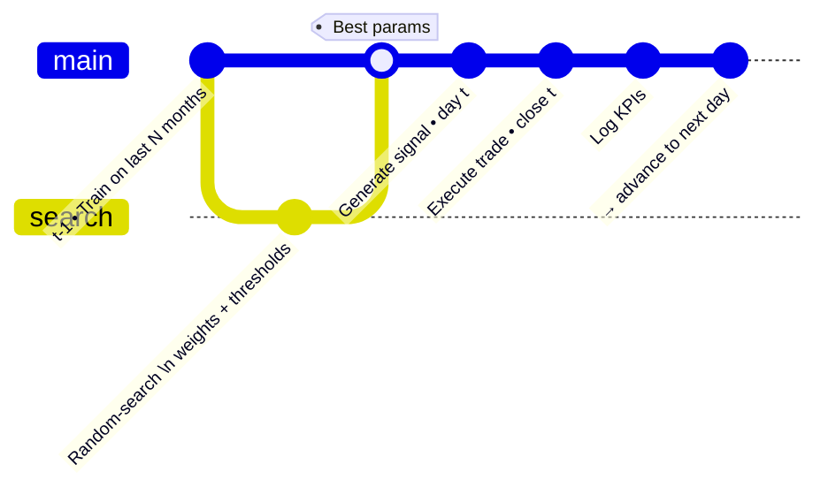

# Trading_Strategy_Development

Back-testing engine that **adapts day-by-day**:  
for each trading date it re-trains on the *N* previous months of data, picks the best sentiment mix via random search, executes the next-day trade, and records full performance stats.

---

## What it does
1. **Daily random search** – finds the best weights (VADER + 4 HF models), buy/sell thresholds, and verified-account factor on the training window that ends the day before.  
2. **Walk-forward simulation** – moves one day ahead, sends the trade, updates cash & position.  
3. **Detailed KPI dump** – Total Return, CAGR, annual volatility, max drawdown, yearly out-performance vs buy-and-hold, mean € gap vs stock.

*(No rolling averages or technical indicators are used inside the model — only the daily sentiment features you provide.)*

---

## Daily Adaptive Loop



---

## Folder layout
```
Trading_Strategy_Development/
├── src/
│   ├── model.py               # SentimentTradingModel class
│   ├── Utils_simulations.py   # simuler_marche_journalier()
│   └── Utils_study_results.py # KPI calc + batch runner
├── Notebooks/
│   ├── TSD.ipynb              # step-by-step example
│   └── Study_results.ipynb    # aggregate & plot batch runs
└── README.md
```

---

## Quick start

```bash
# Single adaptive run on Tesla
python src/Utils_simulations.py \
  --sentiment_csv ../../data/processed/tsla_sentiment.csv \
  --price_csv     ../../data/market/TSLA.csv \
  --lookback_months 6 \
  --n_iter 200 \
  --capital 10000 \
  --out_dir results/tsla_run

# Batch scan: 3 look-back lengths × 2 search sizes
python src/Utils_study_results.py \
  --sentiment_csv ../../data/processed/tsla_sentiment.csv \
  --price_csv     ../../data/market/TSLA.csv \
  --train_lengths 3 6 12 \
  --n_iter_list   100 250 \
  --capital 10000 \
  --out_root results/batch
```

### Key outputs (examples)

| Path (under `Notebooks/`)                | Purpose |
|----------------------------------------------------|---------|
| `df_historique_saves/df_50_iter_1_mois.csv`        | Full daily equity curve and trade log for one run |
| `df_historique_param/df_params_50_iter_1_mois.csv` | Hyper-parameters chosen each day for the same run |
| `df_global/results_global.csv`                               | Leader-board — one line per completed run |
| `df_global/results_global_mois_1.csv`                        | KPIs aggregated month-by-month 1 |

> Open **`Notebooks/Study_results.ipynb`** to load these CSVs, rank the runs, and visualise how parameters evolve over time.
---

## Main pieces

| File / Function | Role |
|-----------------|------|
| **`model.py` / `SentimentTradingModel`** | Combines the five sentiment columns with custom weights; random-searches hyper-parameters; outputs buy / sell / hold signal. |
| **`Utils_simulations.py` / `simuler_marche_journalier`** | Daily loop → train, signal, trade, log. |
| **`Utils_study_results.py` / `analyser_performance_portefeuille`** | Computes KPIs and plots equity curve. |
| `simulation_download_results()` | Runs hundreds of experiments and aggregates results. |

---

## Key parameters

| Arg / Attr | Controls | Typical values |
|------------|----------|----------------|
| `lookback_months` | Training window length | 3 / 6 / 12 |
| `n_iter` | Random-search iterations per day | 100 – 500 |
| `buy_threshold / sell_threshold` | Entry / exit cut-offs | sampled in [0, 1] / [-1, 0] |
| `weights` | 4-tuple (VADER + 3 HF) — Σ = 1 | auto-sampled |
| `weight_verified` | Extra weight for verified accounts | 0 – 1 |

---

## Interpreting KPIs

| Metric | Meaning |
|--------|---------|
| **Total Return** | overall % gain |
| **CAGR** | compound annual growth rate |
| **Annual Volatility** | σ of daily returns × √252 |
| **Max Drawdown** | worst peak-to-trough drop |
| **Annual Out-perf.** | CAGR(strategy) – CAGR(stock) |
| **Avg € gap vs stock** | mean daily € difference vs buy-and-hold (scaled to initial capital) |

Aim for high Total Return & CAGR with low Max DD and acceptable volatility.

---

## Roadmap

* Replace random search with **Optuna Bayesian optimisation**.  
* Add stop-loss / take-profit logic.  
* Scale to **multi-asset** portfolios.  
* Expose the loop as a **FastAPI** service for live paper trading.

Questions or suggestions? Open an issue or PR — contributions welcome!
