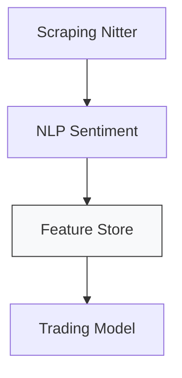

# 🐦 Collecte & Préparation des Tweets

## Pourquoi Twitter ?

Twitter est une plateforme où l'information circule vite, brute et en grande quantité.  
C’est un véritable flux continu d’opinions, de réactions et de spéculations, souvent en lien direct avec l’actualité économique ou les entreprises cotées en bourse.

Dans notre cas, nous nous intéressons à **Tesla ($TSLA)**.  
Notre hypothèse : les messages postés quotidiennement au sujet de Tesla pourraient refléter, voire anticiper, les mouvements de son cours boursier.

---

## Objectif de cette section

Avant d’analyser ou de modéliser quoi que ce soit, il faut construire une **base de données propre, fiable et exploitable**.  
Dans ce chapitre, nous allons donc :

- **Scraper automatiquement** des tweets à l’aide de [Nitter](https://nitter.net), une alternative à Twitter sans JavaScript ni authentification API.
- **Nettoyer les textes** : suppression des liens, mentions, ponctuations, etc.
- **Filtrer les langues** pour ne garder que les tweets en anglais.
- **Analyser le sentiment** de chaque tweet avec plusieurs modèles NLP.
- **Sauvegarder** les données propres pour les futures étapes.

---

## Aperçu technique

Le scraping est réalisé en Python avec **Selenium**, et utilise une **rotation automatique de proxies HTTPS** afin de contourner les restrictions d’accès aux contenus Twitter.

Chaque tweet est ensuite enrichi par **5 scores de sentiment** :  
- 1 issu de **VADER** (modèle lexical basé sur des règles),
- 3 provenant de **modèles Transformers spécialisés dans le domaine financier**.

Les résultats sont sauvegardés dans des fichiers CSV organisés **par mois**, ainsi qu’un **fichier global** regroupant toutes les données.

---

## Schéma des données exportées

| Colonne                | Exemple                         | Description                                 |
|------------------------|----------------------------------|---------------------------------------------|
| `id`                   | `1658327123456789`              | Identifiant unique du tweet                 |
| `query_date`           | `2025-04-15`                    | Date de récupération du tweet               |
| `text`                 | Texte brut                      | Contenu original du tweet                   |
| `verified`             | `True`                          | Statut vérifié (compte certifié ou non)     |
| `cleaned_tweet`        | Texte nettoyé                   | Sans liens, mentions, ponctuation, etc.     |
| `sentiment_vader`      | `0.63`                          | Score de sentiment (composé VADER)          |
| `sentiment_{hf_model}` | `1` (`-1`, `0`, `1`)            | Une colonne **par modèle HF** :  • `financialbert`  • `distilroberta_fin`  • `deberta_v3_fin` |

---

Prêt à explorer les premières lignes de code et manipuler les données brutes ?  
➡️ Allons-y avec la première cellule du notebook !
