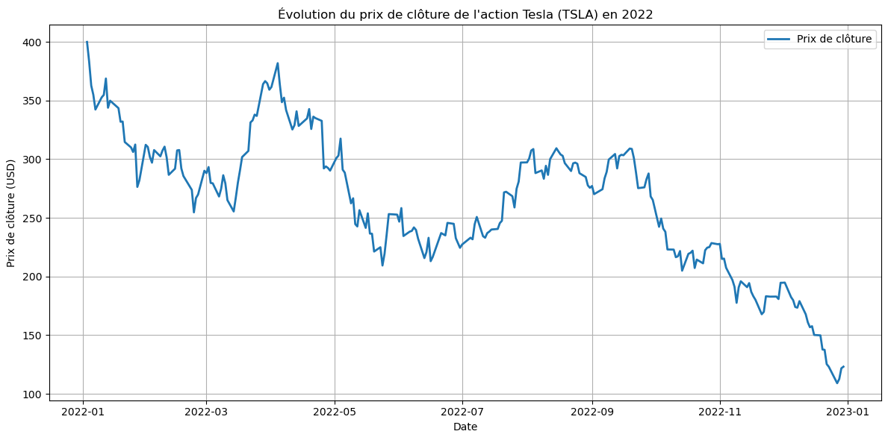

# 🚶‍♂️ Vers une stratégie de trading simple

À partir des signaux calibrés à l'étape précédente, nous allons :

Construire une stratégie d’achat/vente simple, en exploitant les seuils de sentiment.
Tester sa rentabilité sur les données de 2022.
Puis ajuster automatiquement les paramètres pour maximiser la performance de la stratégie.

## Prototype d’une stratégie simple

À partir des signaux de sentiment filtrés et lissés, nous testons une stratégie rudimentaire :

- **Achat** si le sentiment est supérieur à un certain seuil (ex. : 0.4)
- **Sortie du marché** si le sentiment descend en dessous d’un seuil négatif (ex. : -0.4)

Chaque décision est prise à la clôture du jour, en fonction du score de sentiment observé dans la même journée.

> Avec cette stratégie rudimentaire, on obtient une performance annuelle de +0,67 % (hors frais de transaction), alors que l'action a baissé d'environ 68 % cette année-là.
---

## Recherche d’hyperparamètres

Dans cette section, nous ne cherchons pas à améliorer la stratégie en production, mais à **évaluer son potentiel maximal** :  
> *Quelle performance pourrait-on obtenir si l’on optimisait parfaitement les paramètres sur une période donnée ?*

Pour cela, nous effectuons une **recherche exhaustive (grid search)** sur les éléments suivants :

- Le **modèle de sentiment** utilisé (parmi les 4 testés),
- Le **niveau de lissage** appliqué au score (fenêtre mobile de 1 à 7 jours),
- Les **seuils d’achat et de vente**, explorés respectivement entre `0.1` et `1.0` pour l’achat, et entre `-0.1` et `-1.0` pour la vente.

Chaque combinaison est évaluée **a posteriori** sur l’année 2022.  
Nous ne cherchons donc pas ici à créer un modèle généralisable, mais à identifier une **borne supérieure de performance**, c’est-à-dire **le rendement maximum théorique que l'on aurait pu obtenir si l’on avait su choisir les bons hyperparamètres à l’avance**.

---

## Meilleur résultat obtenu (2022)

La meilleure configuration obtenue avec cette stratégie simple est :

| Paramètre                 | Valeur                          |
|---------------------------|----------------------------------|
| Modèle de sentiment       | `FinancialBERT`                 |
| Fenêtre de lissage        | 2 jour                          |
| Seuil d’achat             | `+0.7`                          |
| Seuil de vente            | `-0.4`                          |
| **Performance totale**    | **+48.64 %**                     |

---

## Bilan du prototype

Cette première stratégie, bien que simple et statique, parvient à générer un rendement positif sur l’année étudiée, malgré la tendance baissière de l’action Tesla sur cette période.
Elle démontre qu’un signal de sentiment, correctement filtré et agrégé, peut servir de base à une prise de décision en trading.

Cependant, son efficacité repose sur des paramètres fixes (modèle, seuils, lissage), ce qui limite son adaptabilité aux changements de marché.

➡️ Dans la prochaine section, nous allons concevoir un modèle **plus adaptatif**, capable de réajuster ses paramètres jour après jour.
