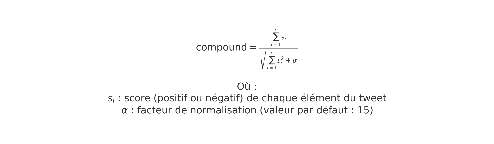
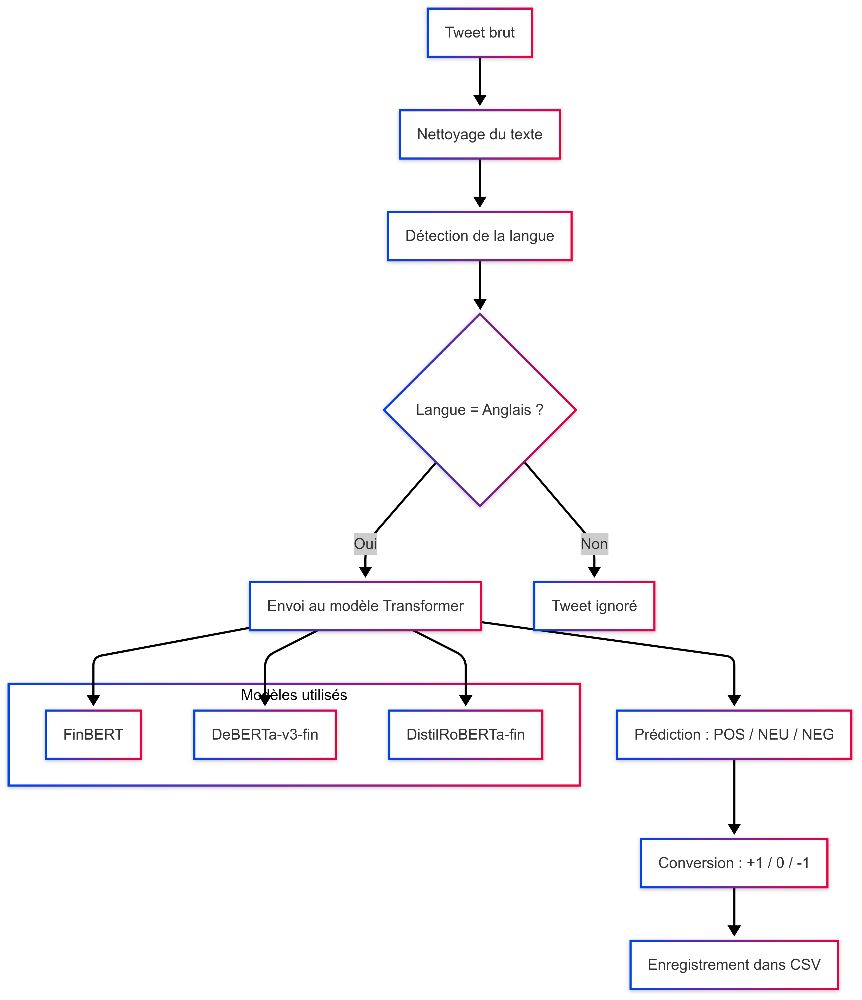

# Analyse des modèles de sentiment

Dans ce chapitre, nous détaillons les modèles d’analyse de sentiment utilisés pour enrichir les tweets relatifs à Tesla.  
Nous présentons d’abord **VADER**, une approche lexicale basée sur des règles, puis les **modèles Transformers** pré-entraînés adaptés au langage financier.

---

## 1. VADER : une approche lexicale basée sur des règles

**VADER** (Valence Aware Dictionary and sEntiment Reasoner) est un outil conçu pour l’analyse de sentiment dans des textes courts tels que les tweets.  
Il repose sur un **lexique de mots scorés** et un ensemble de **règles linguistiques** sans apprentissage automatique.

### Fonctionnement

Chaque mot est associé à un score de valence compris entre −4 et +4.  
Ce score peut être modulé par :

- des majuscules (`GREAT` est plus fort que `great`) ;
- des ponctuations (`!!!`) ;
- des modificateurs d’intensité (`very`, `slightly`, etc.) ;
- des négations (`not good`, `isn't bad`).

### Formule utilisée

Le score final (appelé *compound*) est normalisé dans l’intervalle [−1, +1] à l’aide de la formule :

Où :
- \( s_i \) est le score de chaque mot ou expression ;
- \( \alpha \) est une constante (par défaut : 15).

Le résultat donne un score unique reflétant la tonalité globale du tweet.

---

## 2. Les Transformers : modèles contextuels par attention

Les **Transformers** sont des modèles de langage introduits par Vaswani et al. (2017), fondés sur le mécanisme d’**attention**.  
Contrairement aux approches séquentielles (RNN, LSTM), ils traitent l’ensemble du texte en parallèle et captent les dépendances entre mots, même distants.

### Fonctionnement général

Chaque mot est converti en un vecteur, puis comparé aux autres mots du texte via des **poids d’attention**.  
Cela permet de modéliser le contexte d’un mot selon sa relation avec les autres termes.

### Modèles utilisés dans notre projet

Nous avons appliqué plusieurs Transformers spécialisés dans le domaine financier :

- `ProsusAI/finbert`
- `deberta-v3-financial-news-sentiment`
- `distilroberta-financial-news-sentiment`

Chaque tweet est analysé individuellement, et le modèle retourne une **classe de sentiment** :

- `POSITIVE` → **+1**  
- `NEUTRAL` → **0**  
- `NEGATIVE` → **−1**

Ces scores sont ensuite intégrés dans notre base de données.

---

## 3. Schéma de traitement appliqué aux tweets

Le diagramme suivant illustre l’enchaînement des étapes dans notre pipeline de traitement du sentiment à partir des tweets collectés :

---

## 4. Comparaison des deux approches

| Critère                        | VADER                     | Transformers financiers         |
|-------------------------------|---------------------------|---------------------------------|
| Approche                      | Lexicale (basée sur règles) | Apprentissage profond (NLP)    |
| Données requises              | Aucune                    | Corpus pré-entraînés massifs    |
| Vitesse                       | Très rapide               | Plus lente                      |
| Capacité à comprendre le contexte | Limitée                 | Élevée                          |
| Adaptation au domaine financier| Faible                    | Excellente                      |
| Interprétabilité              | Très bonne                | Moyenne à faible                |

Nous avons utilisé VADER comme **point de référence rapide** et facilement interprétable, tandis que les Transformers ont été mobilisés pour fournir une **analyse fine**, tenant compte du langage spécifique à la finance.

---

## 5. Pour aller plus loin

Pour comprendre plus en détail le fonctionnement des Transformers et du mécanisme d’attention, nous recommandons cette visualisation interactive :

🔗 [Transformer Visualizer – Polo Club](https://poloclub.github.io/transformer-explainer/)

Ce site permet d’explorer les flux d’attention et la façon dont chaque mot est influencé par les autres dans une phrase.

---

Dans la section suivante, nous analyserons comment les scores de sentiment obtenus évoluent dans le temps et comment ils sont corrélés avec les cours boursiers de Tesla.
