# 📈 Présentation du modèle de trading adaptatif

## 🎯 Objectif de cette partie

Dans cette section, on présente la **logique de fonctionnement** du modèle de trading développé dans ce projet.

L’idée principale est simple :  
> Chaque jour, le modèle s’adapte aux données les plus récentes pour décider s’il faut acheter, vendre ou rester neutre.

On va donc expliquer :
- comment la stratégie s’ajuste dans le temps,
- quels paramètres sont recalibrés quotidiennement,
- et comment tout cela s’inscrit dans une boucle de décision automatisée.

---

## 🔁 La boucle quotidienne

Chaque jour, le modèle suit les étapes suivantes :

1. Il s'entraîne sur les données des **N dernières périodes** (souvent 1 ou 2 mois).
2. Il teste **plusieurs combinaisons de paramètres** via une recherche aléatoire :
   - poids appliqués aux scores de sentiment,
   - seuils d’achat et de vente,
   - pondération des tweets vérifiés.
3. Il sélectionne la configuration qui aurait donné le meilleur résultat sur l’historique.
4. Il utilise cette configuration pour **générer un signal** pour la journée en cours.
5. Il **exécute le trade** (achat, vente ou rien).
6. Il met à jour le portefeuille et **enregistre les résultats**.

---

## ⚙️ Ce que le modèle ajuste chaque jour

| Élément optimisé       | Rôle dans la décision                      |
|------------------------|--------------------------------------------|
| `weights`              | Poids appliqués aux différents scores de sentiment |
| `buy_threshold`        | Seuil au-dessus duquel un achat est déclenché |
| `sell_threshold`       | Seuil en dessous duquel une vente est déclenchée |
| `weight_verified`      | Pondération supplémentaire pour les tweets vérifiés |

---

## 🔄 Schéma du processus

> Ce schéma résume la boucle quotidienne : entraînement, optimisation, décision, exécution — puis on passe au jour suivant.
