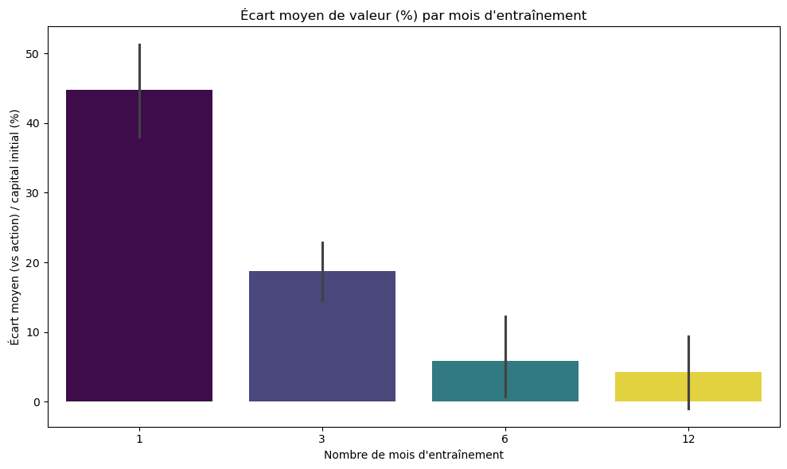
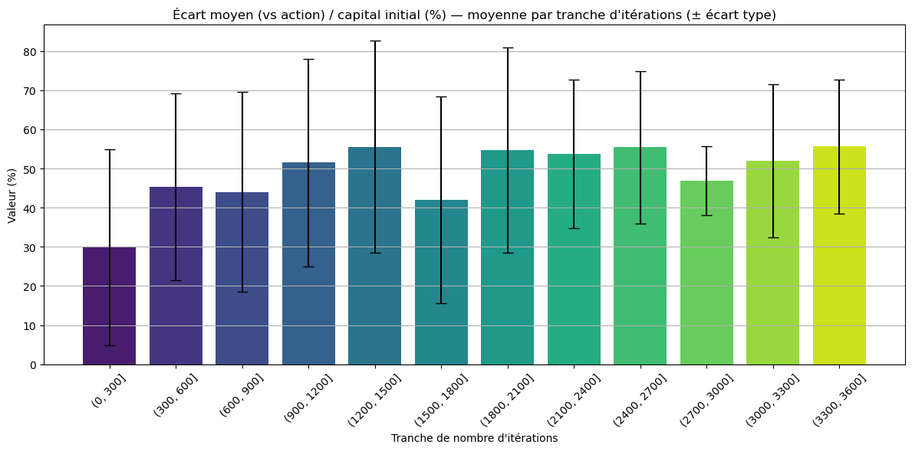
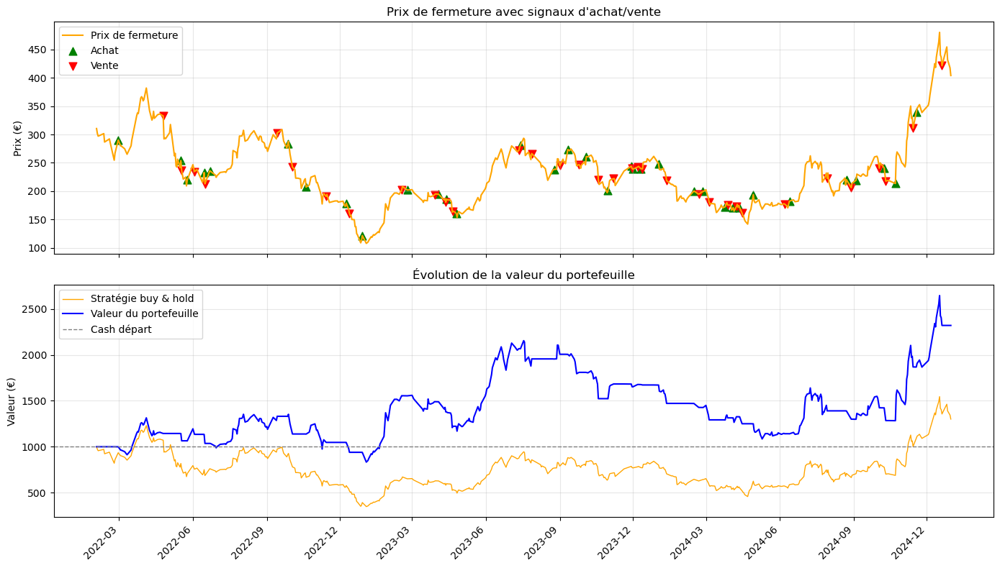

# 📊 Analyse des performances

## 1. Résultats globaux

Afin d’évaluer la qualité de la stratégie, plusieurs simulations (144) ont été réalisées en faisant varier deux paramètres clés :
- le **nombre d'itérations** de la recherche aléatoire chaque jour,
- la **taille de la fenêtre d'entraînement** (en mois).

Chaque simulation a produit un ensemble de KPIs (Key Performance Indicators) : rendement total, volatilité, drawdown, surperformance par rapport à TSLA, etc.

> Pour comparer les différentes configurations de manière simple et directe, nous utilisons comme indicateur principal **l’écart moyen par jour entre la stratégie et la stratégie passive (buy & hold)**, exprimé en pourcentage du capital initial.

---

### Impact de la fenêtre d'entraînement

Le graphique suivant illustre l’impact du **nombre de mois utilisés pour entraîner le modèle** sur la qualité du résultat.

> Les fenêtres courtes (1 mois) donnent les meilleurs résultats.  
Quand la fenêtre est trop longue, les signaux deviennent moins réactifs ou trop dilués.

---

### Écart moyen vs stratégie passive (selon le nombre d’itérations)

L’histogramme ci-dessous montre l'**écart moyen de performance** entre la stratégie et un buy & hold passif, en fonction du nombre d'itérations par jour.

> Les performances s’améliorent clairement jusqu’à **1500 itérations** environ.  
> Au-delà, les gains se stabilisent, avec une variabilité qui reste notable.  
> Les faibles nombres d’itérations (< 300) donnent de moins bons résultats, suggérant un manque d’exploration des paramètres.

---

## 2. Exemple d’un run gagnant

Le graphique ci-dessous montre un exemple de simulation réussie.  
On y voit l’évolution du portefeuille par rapport à la stratégie buy & hold, ainsi que les signaux d’achat et de vente déclenchés.

> La stratégie active évite les baisses prolongées et saisit plusieurs hausses.  
Elle aboutit à un capital final nettement supérieur à la stratégie passive.

---

## 3. Comparaison avec Buy & Hold

Un indicateur central est l’**écart moyen journalier** entre notre portefeuille et celui de la stratégie buy & hold.

- En moyenne, la stratégie a généré un **écart positif de plusieurs dizaines d’euros par jour**.
- Ce gain est obtenu à partir d’un capital initial fixe (1000 €).

Cela signifie que le modèle génère bien un **alpha** exploitable à partir du signal de sentiment social.

---

## Conclusion de la stratégie

- La stratégie adaptative surperforme **clairement** une approche passive, surtout lorsqu’elle est recalibrée fréquemment.
- Des **fenêtres d’entraînement courtes (1 mois)** permettent au modèle de mieux capter l’évolution rapide du sentiment social.
- L’impact du nombre d’itérations est réel : un minimum est nécessaire pour que la recherche d’hyperparamètres soit efficace, mais au-delà d’un certain seuil, les gains ont tendance à se stabiliser.

Le bruit collectif (def : l’ensemble des opinions, réactions, émotions ou rumeurs exprimées par la foule) devient ainsi un indicateur exploitable, à condition d’être combiné à un cadre adaptatif rigoureux.

---

### Perspectives

- Étendre la méthode à un **portefeuille multi-actifs**
- Remplacer la random search par une **optimisation bayésienne (Optuna)**
- Tester un modèle qui s’entraîne chaque jour sur les **N dernières semaines** au lieu des N derniers mois, pour voir si cela améliore la réactivité et la performance.
- **Enrichir le modèle avec des données complémentaires** : intégrer d'autres sources d'information pour croiser les signaux de sentiment avec des éléments factuels et comportementaux. Cela inclut :
  - les **volumes de recherche Google Trends**, pour mesurer l'intérêt public sur un actif,
  - les **indicateurs techniques de marché** (RSI, momentum, volatilité implicite, etc.), pour intégrer la dynamique des prix,
  - ainsi que des **données fondamentales d'entreprise**, telles que les **rapports financiers trimestriels**, les **prévisions de résultats**, ou les **changements dans la gouvernance**.  
  L’objectif est de construire un cadre décisionnel plus robuste, en combinant **bruit social**, **réalité économique** et **comportement de marché**.

### Codes + Notebooks 

> Vous retrouverez les code et les notebooks dans ce lien github : [text](https://github.com/LimamS-GitHub/Market_sentiment_analysis/tree/main)
